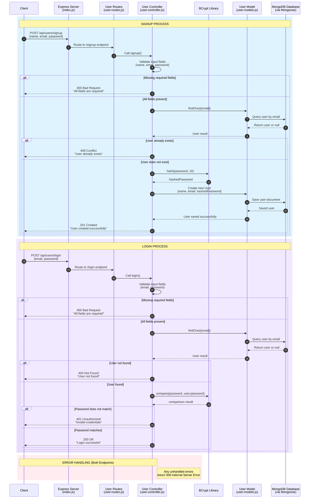
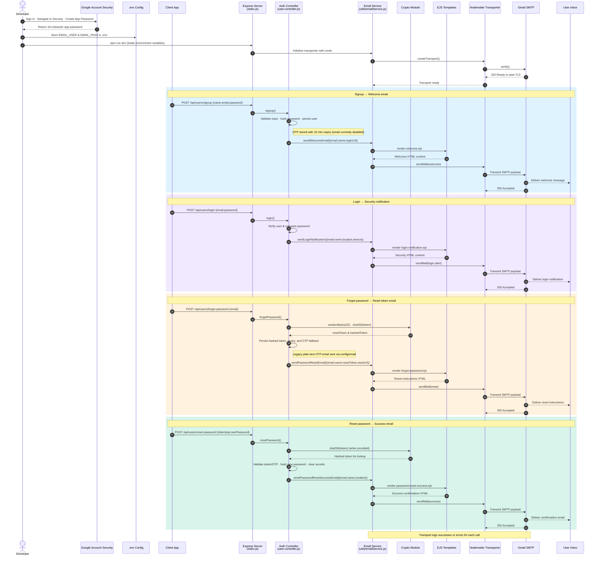

# Authentication System Diagram

This diagram shows the step-by-step process for the signup and login endpoints in this project.

## Signup and Login Flow

## System Components

### 1. **Client**
   - Sends HTTP requests to the server
   - Endpoints: `POST /api/users/signup` and `POST /api/users/login`

### 2. **Express Server (index.js)**
   - Entry point of the application
   - Configures middleware (express.json, morgan)
   - Connects to MongoDB
   - Routes requests to appropriate routers

### 3. **User Routes (user.routes.js)**
   - Defines API endpoints
   - Maps `/signup` to signup controller
   - Maps `/login` to login controller

### 4. **User Controller (user.controller.js)**
   - Contains business logic for authentication
   - Validates input data
   - Interacts with database through models
   - Handles password hashing and comparison
   - Returns appropriate HTTP responses

### 5. **BCrypt Library**
   - Hashes passwords during signup (salt rounds: 10)
   - Compares plain text passwords with hashed passwords during login

### 6. **User Model (user.models.js)**
   - Defines MongoDB schema (name, email, password)
   - Enforces unique email constraint
   - Includes timestamps

### 7. **MongoDB Database**
   - Stores user documents
   - Handles queries and data persistence

## Flow Summary

### Signup Process (Steps 1-14)
1. Client sends signup request with name, email, password
2. Express routes to signup endpoint
3. Controller validates all required fields
4. Check if user already exists by email
5. If exists, return 409 Conflict
6. If not exists, hash the password using bcrypt
7. Create new user document with hashed password
8. Save to MongoDB
9. Return 201 Created on success

### Login Process (Steps 15-26)
1. Client sends login request with email, password
2. Express routes to login endpoint
3. Controller validates all required fields
4. Find user by email in database
5. If not found, return 404 Not Found
6. If found, compare provided password with stored hash
7. If passwords don't match, return 401 Unauthorized
8. If passwords match, return 200 OK

## HTTP Status Codes

| Code | Meaning | When Used |
|------|---------|-----------|
| 200 | OK | Successful login |
| 201 | Created | User successfully created |
| 400 | Bad Request | Missing required fields |
| 401 | Unauthorized | Invalid credentials during login |
| 404 | Not Found | User not found during login |
| 409 | Conflict | User already exists during signup |
| 500 | Internal Server Error | Unhandled server errors |

## Email Delivery Flow

